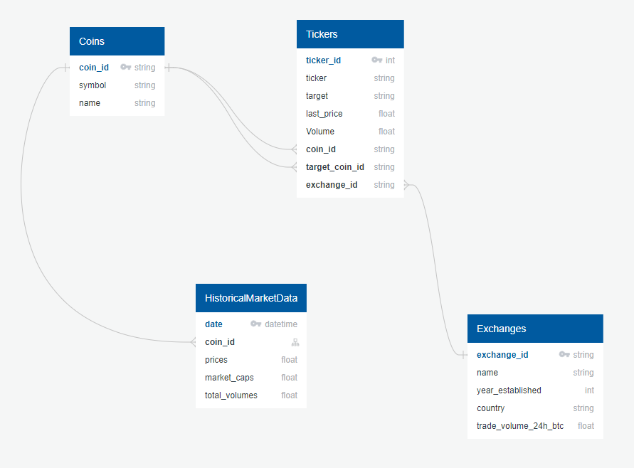

# CryptoAnalysis

## Introduction 

This analysis will look into metrics of the cryptocurrency market, such as open, high, low, close (OHLC) data, order volume and volume. This will compare the top exchanges as well as the top currencies in terms of volume. This topic was selected to better understand market trends, market share, and will try to predict future action of the market based on past performance.

#### Source Data

The data used in this analysis was pulled from the CoinGecko API. Both historical and current data will be used, and the historical data will be up to 3 years in the past ranging from Oct 31, 2018 to Oct 31, 2021. The documentation for this API can be found in the link below >>>

#### Questions Intended To Answer

In this analysis, I intend to answer the following questions:

- What is the trend of the cryptocurrency market in the past 3 years, and can this be used to predict the growth of the market?

- What are the top performing cryptocurrency projects and what is their share of the market? Is the market share becoming monopolized or is the distribution increasing?

- What are the most popular exchanges used, and what is their growth in the past 3 years? Will they keep growing and what is the expected growth if so?

## Analysis

### Database ERD and Structure

The data used in this project will be stored in PostgreSQL database after being retrieved and cleaned. The data will be stored in 6 tables that will be described below and shown in the ERD pictured.

#### Coins Table

The coins table will store the coin ids and their information, such as symbol and name.

###### Fields Used

- **CoinID**

- **Symbol**

- **Name**

#### Exchanges Table

#### OHLC Table

#### Tickers Table

#### HistoricalMarketData Table

#### HistoricalExchangeVolume Table
